# Security Assessment — Executive Summary
## Open Mercato v0.4.8 / v0.4.9

**Assessment period:** 2026-03-26 to 2026-03-28
**Assessor:** Independent security review
**Scope:** Web application, AI assistant surface, workflow engine, CI/CD pipeline, container configuration
**Test environment:** Self-hosted Docker, isolated lab network — no production systems accessed

---

## Overview

This assessment identified **two critical vulnerabilities** — one introduced in the latest upstream release — alongside six high/medium findings and an active supply chain risk that warrants elevated priority due to current threat actor activity.

The most severe finding allows any admin user to extract all application secrets (database credentials, JWT signing key, encryption keys) through the web interface in under 60 seconds, with no server access required. A second critical finding allows an admin to reach internal network services including the Meilisearch search index and, on cloud deployments, cloud provider metadata endpoints carrying IAM credentials.

The platform's core security model — multi-tenant data isolation, staff/customer separation, RBAC enforcement, PII encryption — is well-designed and consistently implemented. The critical findings are isolated to two specific surfaces: the AI Code Mode sandbox (v0.4.9 only) and the workflow webhook activity.

**All critical and high findings have complete fix plans.** The two critical issues each require under two hours of engineering time to resolve.

---

## Finding Landscape

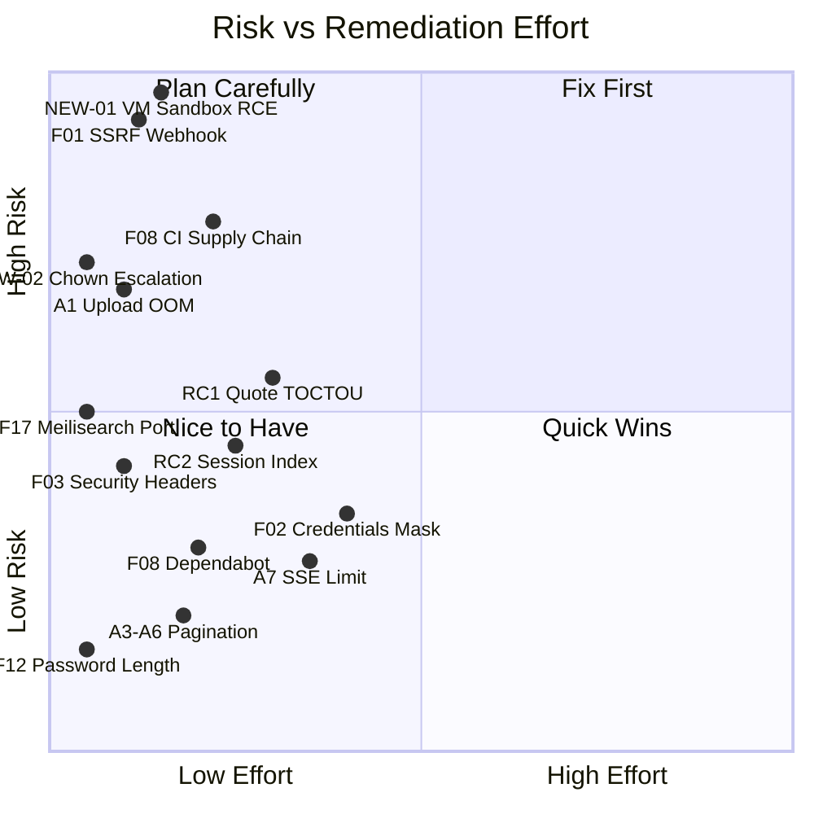

---

## Severity Summary

| ID | Finding | Severity | CVSS | Auth Required | Status |
|----|---------|----------|------|---------------|--------|
| NEW-01 | VM Sandbox Escape — RCE | **Critical** | 9.9 | `ai_assistant.view` (admin) | v0.4.9 only |
| F01 | SSRF via CALL_WEBHOOK | **Critical** | 8.6 | Admin role | All versions |
| NEW-02 | Container Privilege Escalation | **High** | Post-RCE | Code execution | All versions |
| A1 | File Upload Memory Exhaustion | **High** | 7.5 | Upload permission | All versions |
| F08 | GitHub Actions Unpinned Tags | **High** | Supply chain | CI access | All versions |
| RC1 | Quote Acceptance Race Condition | **Medium** | 6.5 | None (email token) | All versions |
| RC2 | Session Token Unindexed + Chat Flood | **Medium** | 5.3 | `ai_assistant.view` | All versions |
| F03 | Missing HTTP Security Headers | **Medium** | 5.1 | None | All versions |
| F17 | Meilisearch Network Exposure | **Medium** | 5.0 | Network access | All versions |
| A7 | SSE No Per-User Connection Limit | **Medium** | 4.8 | Auth | All versions |
| F02 | Integration Credentials in Plaintext | **Medium** | 4.3 | Admin | All versions |
| A3/A5/A6 | Unbounded Pagination | **Low** | 3.1 | Admin | All versions |
| F12 | Default Password Minimum 6 Chars | **Low** | 2.0 | None | All versions |

---

## Critical Attack Chains

### Chain A — Full Compromise via AI Code Mode (External, No Machine Access)

This chain requires only an admin account and network access to the web interface. No SSH, no server credentials, no tooling beyond a browser.

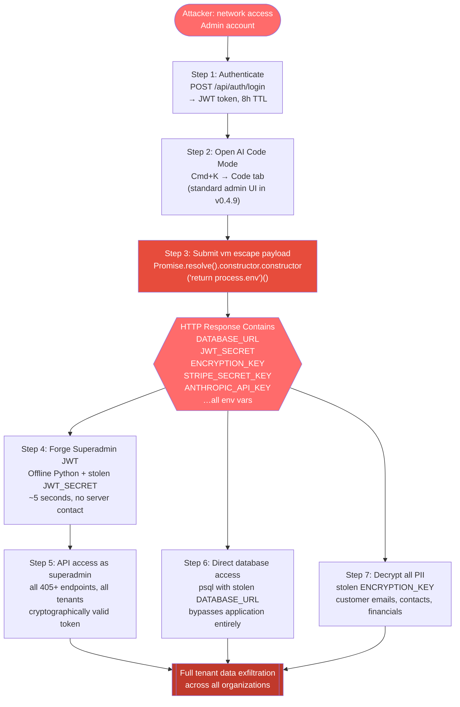

**Root cause:** `node:vm` is not a security boundary. Node.js documentation explicitly states this. The `Promise` injected into the sandbox retains its outer-context prototype chain, reaching the outer `Function` constructor and from there the full Node.js runtime with all native modules. This is not a configuration issue — there is no blocklist or context restriction that closes it. Any injected outer-runtime object (`Promise`, `Object`, `Array`) preserves its prototype link to `Function`.

**Affected:** v0.4.9 only. Not present in v0.4.8 (current local version).

**Fix:** Replace `node:vm` with `isolated-vm` (V8 Isolates) or remove code execution entirely — the AI agent only needs `api.request()`.

`isolated-vm` uses V8 Isolates — a completely separate V8 heap per execution context. The escape vector is structurally closed: the `Promise` inside an Isolate was created in a genuinely different V8 context, so there is no outer `Function` constructor to reach. Works in Alpine with no kernel capabilities required, as an npm dependency.

---

### Chain B — SSRF → Internal Network + Cloud Metadata

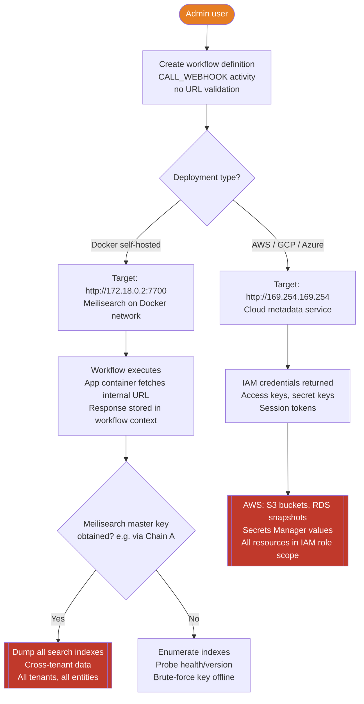

**Confirmed live:** Meilisearch access log shows `method=GET host="172.18.0.2:7700" user_agent=node status_code=200` from the app container after workflow execution.

**Adjacent context:** `CALL_API` in the same file (line 821) has SSRF prevention with explicit comments. `CALL_WEBHOOK` was added without the equivalent protection.

**Fix:** Add `validateWebhookUrl()` before `fetch()` in `executeCallWebhook()`. 30 minutes of engineering time.

---

### Chain C — Quote Race Condition → Duplicate Orders

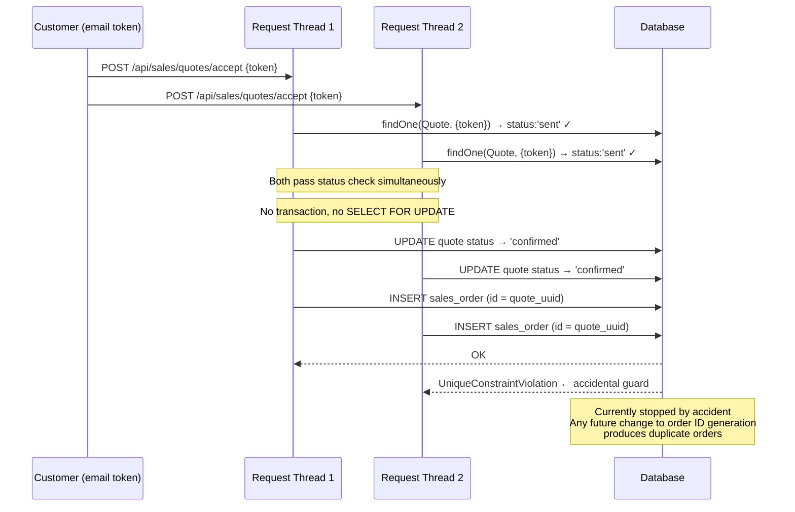

**Auth required:** None — exploitable by any customer who received an acceptance email link.

---

### Chain D — Container Privilege Escalation (Post–Chain A)

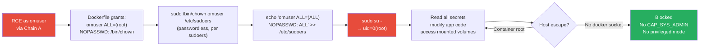

---

## Supply Chain Risk — GitHub Actions (Elevated Priority)

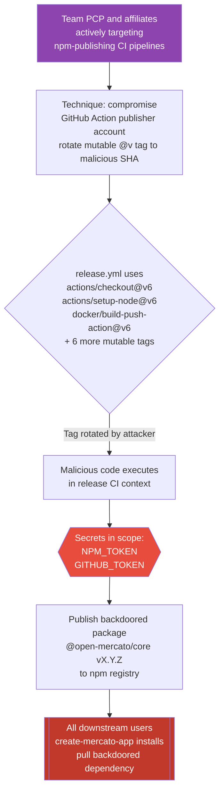

**Severity raised to High/P1** based on current threat actor activity. This is no longer a theoretical risk — Team PCP has used this exact technique against npm-publishing workflows. The fix is pinning all actions to full commit SHAs and adding Dependabot for automated SHA updates.

---

## Meilisearch Exposure — Impact Depth

Meilisearch holds a single shared search index covering all tenants. Tenant isolation is enforced at the application layer only; the index itself has no per-tenant access control. If the master key is obtained (via env dump from Chain A, or via credential leak/brute-force), the entire search corpus is readable cross-tenant with a single API call.

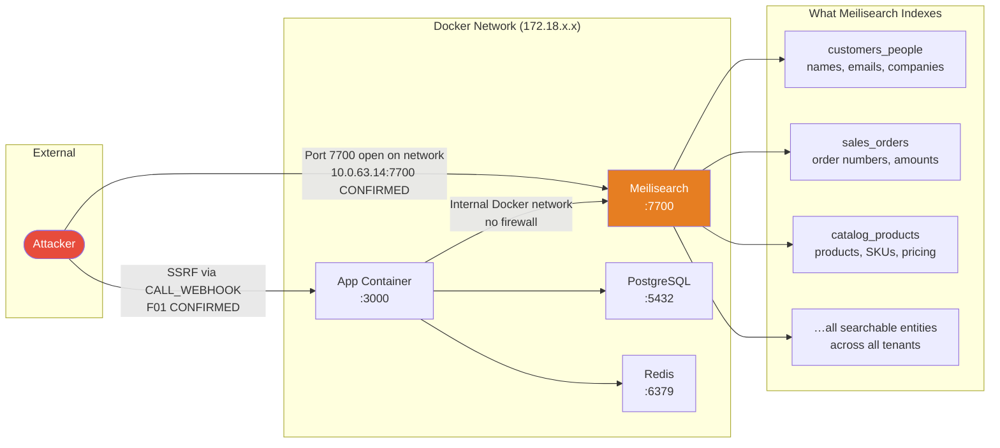

**Current state:** Port 7700 is network-accessible; default key was rejected (custom key set — good). Risk is medium today, upgrades to critical on any credential leak.

**Fix:** `ports: ["127.0.0.1:7700:7700"]` in docker-compose. Five minutes.

---

## Authentication Architecture

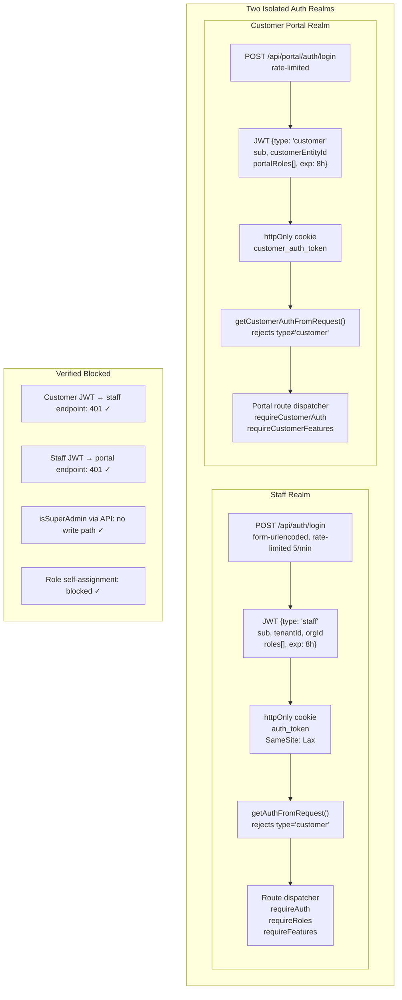

---

## Platform Security Strengths

These controls were verified and found effective. They are worth preserving as the platform evolves.

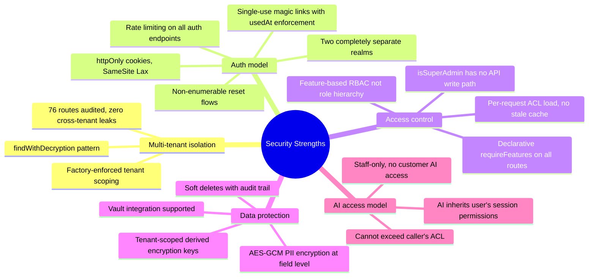

---

## Remediation Roadmap

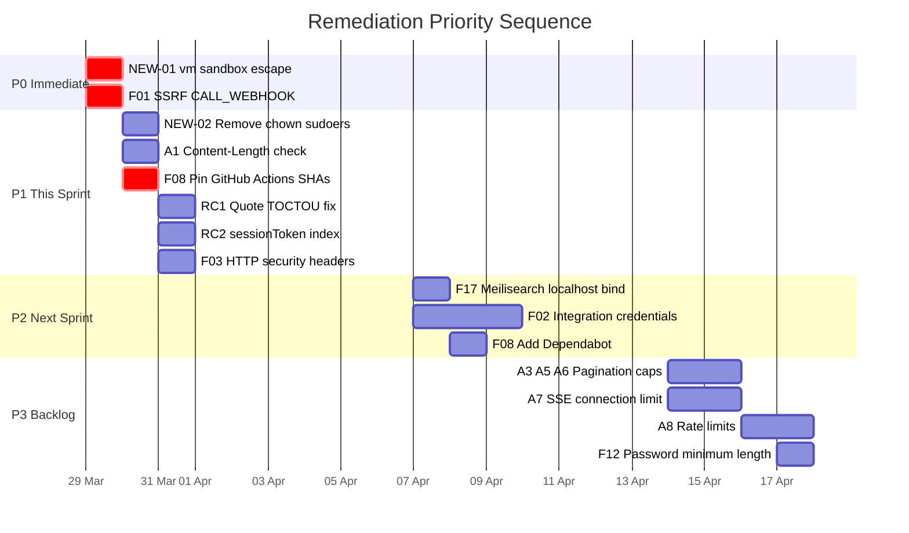

---

## Effort vs. Impact Summary

| Priority | Finding | Fix Effort | Impact If Unresolved |
|----------|---------|------------|---------------------|
| **P0** | NEW-01: VM sandbox RCE | Replace `node:vm` (~2h) | All secrets exfiltrated via browser; full tenant compromise |
| **P0** | F01: SSRF CALL_WEBHOOK | 30 min | Internal network reachable; AWS IAM credentials on cloud |
| **P1** | NEW-02: chown escalation | 2 min (remove 1 line) | Post-RCE container root; complete persistence |
| **P1** | A1: Upload OOM | 15 min | Any authed user OOM-kills server, all tenants offline |
| **P1** | F08: CI supply chain | 30 min | Backdoored npm package to all `create-mercato-app` users |
| **P1** | RC1: Quote TOCTOU | 1h | Duplicate orders via race; accidental guard only |
| **P1** | RC2: Session index | 30 min | Auth degradation under load; table scan every tool call |
| **P1** | F03: Security headers | 10 min | Clickjacking, MIME sniffing, referrer leakage |
| **P2** | F17: Meilisearch bind | 5 min | Cross-tenant search data on key compromise |
| **P2** | F02: Credentials mask | 2h | Integration secrets in browser DevTools / proxy logs |

---

## What Was Not Vulnerable

The following areas were audited and confirmed secure. Documenting these explicitly to distinguish the scope of concern.

| Surface | Tested | Result |
|---------|--------|--------|
| SQL injection (Knex whereRaw) | All parameterised bindings audited | No interpolation of user input |
| XSS via React | All dangerouslySetInnerHTML usages | react-markdown escapes HTML by default |
| Path traversal in file storage | resolveAttachmentAbsolutePath | Strips `../`, sanitises to safe chars |
| Command injection (execFile usage) | Arguments as array | No shell string construction |
| IDOR / cross-tenant data | 76 routes across customers, sales, catalog | All correctly scope tenantId + organizationId |
| Customer → staff realm escalation | type:'customer' JWT on staff endpoint | 401 — hard rejection at auth utility |
| Employee → admin privilege escalation | No write path to isSuperAdmin | Flag is DB-only, no API surface |
| Magic link token replay | usedAt enforcement in customerTokenService | Single-use confirmed |
| Account enumeration | Password reset, login error messages | Always returns generic response |

---

## Architectural Note — BYOAI Model

The VM sandbox finding (NEW-01) is not a bug in the sandbox configuration — it is a consequence of `node:vm` being fundamentally unsuitable for arbitrary code execution. Any sandbox built on it can be escaped via the `Promise` constructor chain on Node.js 22.

A more durable solution than replacing the sandbox is removing the need for one:

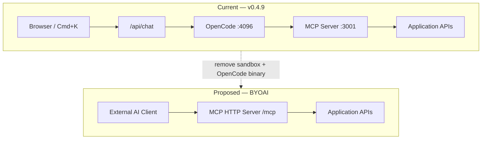

**What this achieves:**
- The vm sandbox vulnerability class is structurally eliminated — no server-side code execution
- OpenCode (a third-party binary) is removed from the trust chain
- Users bring their own AI client (Claude Desktop, any MCP-compatible tool) and any model
- Customer agents become possible: portal-scoped API key → portal MCP surface
- Audit trail improvement: API key identity recorded, not just user identity

The MCP server and API key infrastructure already exist. This is a removal of components, not an addition.

---

## Evidence Index

All raw evidence is in `.ai/security/evidence/`:

| File | Contents |
|------|---------|
| `F01-ssrf-call-webhook.txt` | Workflow execution trace + Meilisearch access log (user_agent=node confirmed) |
| `F03-security-headers.txt` | `curl -sI` output — all 6 headers absent |
| `RC1-quote-toctou.txt` | Concurrent test log + UniqueConstraintViolationException at 15:49:23.037Z / .044Z |
| `A3-workflow-unbounded-limit.txt` | API response with `limit:999999` echoed in pagination envelope |
| `F17-meilisearch-exposure.txt` | Port reachability + key probe results |
| `ATTACK-CHAIN-EXTERNAL.md` | Step-by-step reproduction of Chain A |
| `NEW01-vm-sandbox-escape-CONFIRMED.json` | Machine-readable confirmation record |
| `screenshots/06a-NEW01-ai-code-mode-open.png` | AI Code Mode accessible in admin UI |
| `screenshots/06b-NEW01-escape-payload.png` | Escape payload submitted and executed |

Fix plans with exact file paths, line numbers, and code: `.ai/security/fixes/`
Strategic hardening spec: `.ai/specs/SPEC-061-2026-03-26-security-hardening.md`

---

*Assessment conducted in good faith on an isolated self-hosted test environment. No production systems were accessed. No data was exfiltrated. Findings reported privately before any public disclosure.*
