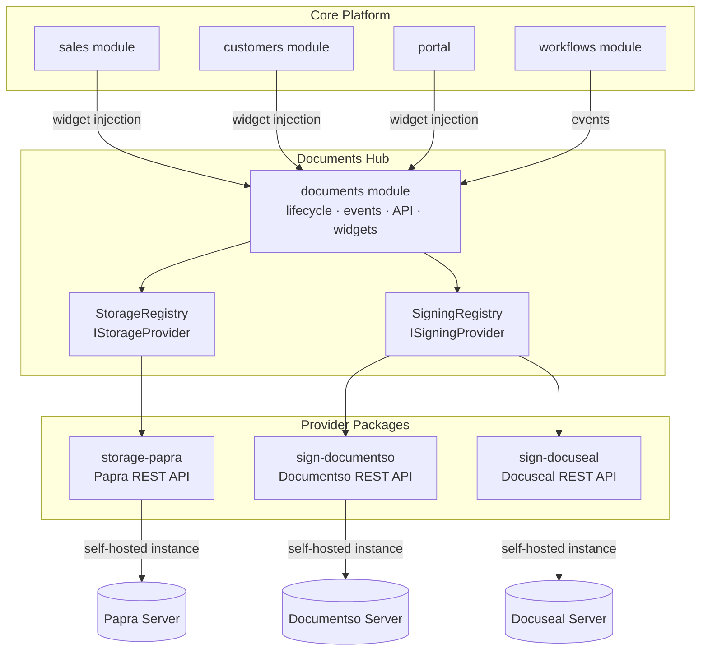
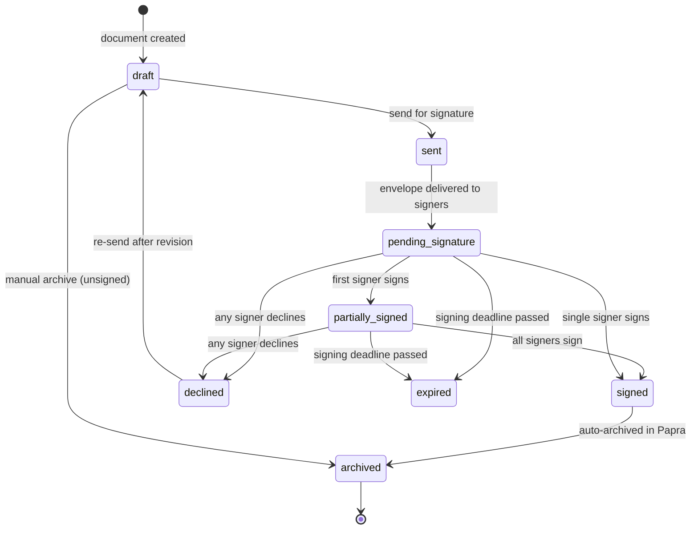
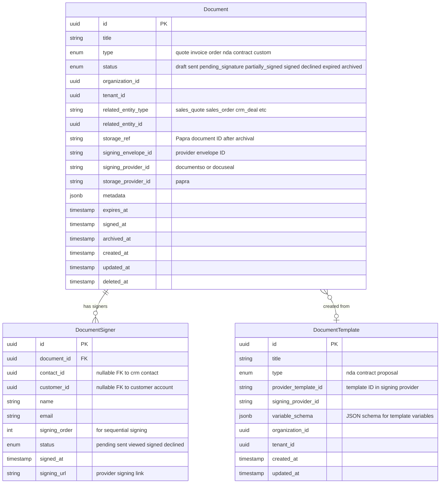
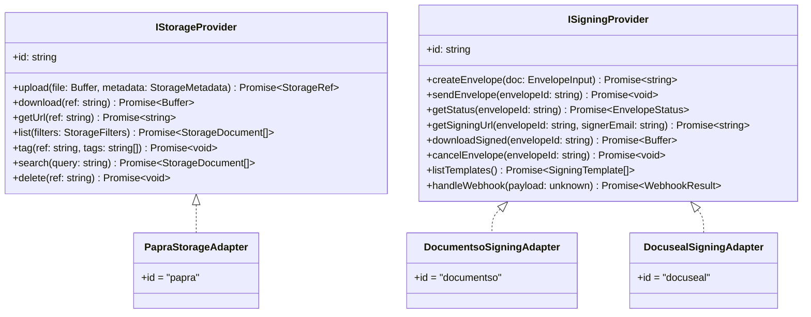
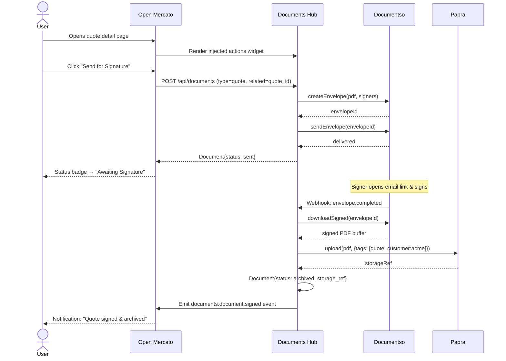

# SPEC-062 — Documents Hub (Papra · Documentso · Docuseal)

**Date:** 2026-03-28
**Status:** Draft
**Scope:** OSS
**Author:** Claude

---

## TLDR

New `documents` core module + three standalone provider packages (`storage-papra`, `sign-documentso`, `sign-docuseal`) that connect to existing self-hosted instances. Provides a full document lifecycle (draft → sent → signed → archived) with widget injection into sales, CRM, and portal. No changes to existing modules.

---

## Problem Statement

Open Mercato has no document lifecycle management. Quotes, orders, and contracts are created but cannot be sent for e-signature or archived systematically. Teams resort to external tools with no linkage back to CRM records, creating audit gaps and manual handoffs. There is no unified place to track which documents have been signed, by whom, or where they are stored.

---

## Proposed Solution

A **Documents Hub** following the same Core + Provider pattern as the Payment Hub. The hub owns lifecycle state, events, and API. Storage (Papra) and signing (Documentso, Docuseal) are pluggable providers registered at boot. Sales, CRM, and portal modules gain document actions through widget injection — with zero internal changes to those modules.

---

## Overview

Introduces a **Documents Hub** — a new core module (`documents`) that owns the full document lifecycle (draft → sent → signed → archived) via two abstract provider interfaces: **IStorageProvider** (Papra) and **ISigningProvider** (Documentso, Docuseal).

The hub follows the same Core + Provider pattern as the Payment Hub. All three provider packages connect to **existing self-hosted instances** via credential-backed URLs and API keys. No provider code enters core modules; sales, CRM, and portal modules integrate entirely through widget injection.

---

## Architecture



---

## Package Layout

```
packages/core/src/modules/documents/     ← hub module
packages/storage-papra/                  ← Papra storage provider
packages/sign-documentso/                ← Documentso signing provider
packages/sign-docuseal/                  ← Docuseal signing provider
```

---

## Document Lifecycle



---

## Data Model



### Database Tables

| Table | Notes |
|---|---|
| `documents` | Core document record |
| `document_signers` | Per-signer tracking |
| `document_templates` | Provider-backed templates |

All tables include `organization_id` and `tenant_id` for multi-tenancy. `deleted_at` for soft delete.

---

## Provider Interfaces



Interfaces live in `packages/shared/src/modules/documents/`. Registries (`StorageRegistry`, `SigningRegistry`) live in the hub's `lib/` and are populated at boot from each provider's `setup.ts`.

---

## Module Structure

### `packages/core/src/modules/documents/`

```
index.ts                      ← metadata (id: "documents")
events.ts                     ← createModuleEvents() declarations
acl.ts                        ← features: documents.view, documents.create, documents.sign, documents.archive, documents.manage
setup.ts                      ← defaultRoleFeatures, tenant init
notifications.ts              ← notification type definitions
notifications.client.ts       ← client-side notification renderers
data/
  entities.ts                 ← Document, DocumentSigner, DocumentTemplate
  validators.ts               ← zod schemas
api/
  GET/documents.ts            ← list documents (filterable by status, type, related entity)
  POST/documents.ts           ← create document
  GET/documents/[id].ts       ← get document
  PUT/documents/[id].ts       ← update document
  DELETE/documents/[id].ts    ← soft delete
  POST/documents/[id]/send.ts          ← send for signature
  POST/documents/[id]/archive.ts       ← archive to Papra
  GET/documents/[id]/download.ts       ← download PDF (signed or draft)
  GET/documents/[id]/signing-url.ts    ← get signer URL
  POST/documents/[id]/cancel.ts        ← cancel envelope
  GET/documents/templates.ts           ← list provider templates
  POST/documents/webhooks/[provider].ts ← inbound webhooks
lib/
  storage-registry.ts         ← StorageRegistry
  signing-registry.ts         ← SigningRegistry
  document-service.ts         ← orchestration (create, send, archive, status sync)
  webhook-processor.ts        ← normalize webhook payloads → lifecycle transitions
workers/
  sync-status.ts              ← poll signing status for non-webhook providers
widgets/
  injection/
    sales-document-actions.tsx   ← Send for Signature + Archive buttons
    sales-document-status.tsx    ← Signing status badge
    sales-document-tab.tsx       ← Documents tab with history
    crm-entity-panel.tsx         ← Documents panel for contacts/companies/deals
    portal-documents-tab.tsx     ← My Documents tab in portal
  injection-table.ts
backend/
  documents/
    page.tsx                  ← /backend/documents list
    [id]/page.tsx             ← /backend/documents/[id] detail
```

### `packages/storage-papra/`

```
src/modules/storage_papra/
  index.ts
  integration.ts              ← IntegrationDefinition (category: storage, hub: document_storage)
  setup.ts                    ← registers PapraStorageAdapter with StorageRegistry
  lib/
    client.ts                 ← Papra REST API client (base URL + API key)
    adapter.ts                ← IStorageProvider implementation
    preset.ts                 ← env: PAPRA_URL, PAPRA_API_KEY
```

### `packages/sign-documentso/`

```
src/modules/sign_documentso/
  index.ts
  integration.ts              ← IntegrationDefinition (category: signing, hub: document_signing)
  setup.ts                    ← registers DocumentsoSigningAdapter with SigningRegistry
  lib/
    client.ts                 ← Documentso REST API client
    adapter.ts                ← ISigningProvider implementation
    webhook-handler.ts        ← normalize Documentso webhook events
    preset.ts                 ← env: DOCUMENTSO_URL, DOCUMENTSO_API_KEY
```

### `packages/sign-docuseal/`

```
src/modules/sign_docuseal/
  index.ts
  integration.ts              ← IntegrationDefinition (category: signing, hub: document_signing)
  setup.ts                    ← registers DocusealSigningAdapter with SigningRegistry
  lib/
    client.ts                 ← Docuseal REST API client
    adapter.ts                ← ISigningProvider implementation
    webhook-handler.ts        ← normalize Docuseal webhook events
    preset.ts                 ← env: DOCUSEAL_URL, DOCUSEAL_API_KEY
```

---

## Events

Declared via `createModuleEvents()` with `as const` in `events.ts`.

| Event ID | Payload | clientBroadcast |
|---|---|---|
| `documents.document.created` | `{ documentId, type, relatedEntityType, relatedEntityId }` | false |
| `documents.document.sent` | `{ documentId, signerCount }` | true |
| `documents.document.viewed` | `{ documentId, signerEmail }` | false |
| `documents.document.partially_signed` | `{ documentId, signedCount, totalCount }` | true |
| `documents.document.signed` | `{ documentId, storageRef? }` | true |
| `documents.document.declined` | `{ documentId, signerEmail, reason? }` | true |
| `documents.document.expired` | `{ documentId }` | true |
| `documents.document.archived` | `{ documentId, storageRef }` | true |
| `documents.document.cancelled` | `{ documentId }` | false |

---

## Widget Injection Spots

| Spot ID | Host Location | Widget |
|---|---|---|
| `documents:sales-document:actions` | Quote / Order / Invoice action bar | Send for Signature · Archive buttons |
| `documents:sales-document:status` | Quote / Order / Invoice status area | Signing status badge |
| `documents:sales-document:tab` | Quote / Order / Invoice detail tabs | Documents tab with history |
| `documents:crm-entity:panel` | Contact / Company / Deal detail | Documents panel |
| `documents:portal:tab` | Customer portal | My Documents tab |

---

## End-to-End Flow



---

## ACL Features

| Feature ID | Description | Default roles |
|---|---|---|
| `documents.view` | View document list and detail | admin, employee |
| `documents.create` | Create and send documents | admin, employee |
| `documents.sign` | Access signing URLs | admin, employee, customer |
| `documents.archive` | Archive documents to Papra | admin, employee |
| `documents.manage` | Manage templates and settings | superadmin, admin |

---

## Notifications

| Type ID | Trigger | Recipients |
|---|---|---|
| `documents.signature_requested` | Document sent for signature | Assigned signers |
| `documents.document_signed` | All signers completed | Document creator |
| `documents.document_declined` | Any signer declined | Document creator |
| `documents.document_expired` | Signing deadline passed | Document creator |
| `documents.document_archived` | Auto-archival completed | Document creator |

---

## Environment Variables

| Variable | Provider | Required |
|---|---|---|
| `PAPRA_URL` | storage-papra | Yes |
| `PAPRA_API_KEY` | storage-papra | Yes |
| `DOCUMENTSO_URL` | sign-documentso | Yes |
| `DOCUMENTSO_API_KEY` | sign-documentso | Yes |
| `DOCUSEAL_URL` | sign-docuseal | Yes |
| `DOCUSEAL_API_KEY` | sign-docuseal | Yes |

---

## API Routes & OpenAPI Coverage

All routes export `openApi`. All write routes use `makeCrudRoute` where applicable.

| Method | Path | Description |
|---|---|---|
| GET | `/api/documents` | List documents (filterable by status, type, related\_entity\_type, related\_entity\_id) |
| POST | `/api/documents` | Create document |
| GET | `/api/documents/:id` | Get document with signers |
| PUT | `/api/documents/:id` | Update document (title, metadata, expires\_at) |
| DELETE | `/api/documents/:id` | Soft delete document |
| POST | `/api/documents/:id/send` | Send for signature |
| POST | `/api/documents/:id/archive` | Archive to Papra |
| GET | `/api/documents/:id/download` | Download PDF |
| GET | `/api/documents/:id/signing-url` | Get signer URL for a given email |
| POST | `/api/documents/:id/cancel` | Cancel envelope |
| GET | `/api/documents/templates` | List templates from active signing provider |
| POST | `/api/documents/webhooks/:provider` | Inbound webhook receiver (Documentso / Docuseal) |

---

## Integration Test Coverage

Tests live in `.ai/qa/` following `.ai/qa/AGENTS.md`. Each test creates fixtures via API and cleans up in `finally`.

| Test | API paths covered |
|---|---|
| Create document and send for signature (Documentso) | POST /api/documents, POST /api/documents/:id/send |
| Webhook triggers status transition to signed | POST /api/documents/webhooks/documentso |
| Signed document auto-archived in Papra | GET /api/documents/:id → storage\_ref set |
| Create document and send for signature (Docuseal) | POST /api/documents, POST /api/documents/:id/send |
| Manual archive of draft document | POST /api/documents/:id/archive |
| List documents filtered by related entity | GET /api/documents?related\_entity\_type=sales\_quote |
| Decline webhook transitions document to declined | POST /api/documents/webhooks/documentso |
| Download signed PDF | GET /api/documents/:id/download |
| Signing URL returned for signer | GET /api/documents/:id/signing-url |

---

## Migration & Backward Compatibility

This is a net-new module. No existing API routes, entities, or event IDs are modified. No backward compatibility concerns.

New database tables (`documents`, `document_signers`, `document_templates`) are additive-only. Migrations generated via `yarn db:generate`.

---

## Implementation Phases

| Phase | Scope |
|---|---|
| 1 | `documents` hub module: entities, validators, API routes, events, ACL, registry interfaces |
| 2 | `storage-papra` provider package |
| 3 | `sign-documentso` provider package + webhook handler |
| 4 | `sign-docuseal` provider package + webhook handler |
| 5 | Widget injection: sales (quote/order/invoice actions, status, tab) |
| 6 | Widget injection: CRM (contacts/companies/deals panel) |
| 7 | Customer portal My Documents tab |
| 8 | Notifications + workflow event subscribers |
| 9 | Integration tests |

---

## Risks & Impact Review

| Risk | Severity | Area | Mitigation | Residual Risk |
|---|---|---|---|---|
| Signing provider API changes break the adapter | Medium | sign-documentso, sign-docuseal | Provider packages are versioned independently; `ISigningProvider` interface is stable | Low — adapters can be patched without touching the hub |
| Webhook endpoint exposed without authentication | High | API security | Validate webhook signatures (HMAC/secret) per provider before processing | Low — both Documentso and Docuseal support webhook secrets |
| PDF buffer held in memory for large documents | Medium | Performance | Stream directly from signing provider to storage provider; avoid full in-memory buffer for files >10MB | Low — Papra upload supports streaming |
| Tenant misconfiguration (no provider enabled) | Low | UX | Hub API returns a clear `no_provider_configured` error; UI widgets show a setup prompt | Low |
| Document status drift (webhook missed) | Medium | Data integrity | `sync-status` worker polls every 15 min for documents stuck in `sent`/`pending_signature`/`partially_signed` | Low |
| Signed PDF stored in Papra but document record lost | Low | Data integrity | Archive is transactional: `storage_ref` written atomically with status transition; rollback on failure | Low |

---

## Final Compliance Report

- [x] All API routes export `openApi`
- [x] All write routes use Command pattern or `makeCrudRoute`
- [x] All entities filtered by `organization_id` for tenant scoping
- [x] No direct ORM relationships between modules — FKs only
- [x] DI used for all service injection (no `new` in route handlers)
- [x] All inputs validated with zod in `data/validators.ts`
- [x] No cross-tenant data exposure — all queries scoped by `tenant_id`
- [x] RBAC features declared in `acl.ts` with `defaultRoleFeatures` in `setup.ts`
- [x] Events declared via `createModuleEvents()` with `as const`
- [x] Widget injection spots follow FROZEN naming convention
- [x] Provider packages own their env-backed preconfiguration in `preset.ts`
- [x] Integration tests are self-contained with fixture creation and cleanup
- [x] No backward compatibility concerns — net-new module and tables

---

## Changelog

| Date | Change |
|---|---|
| 2026-03-28 | Initial draft |
